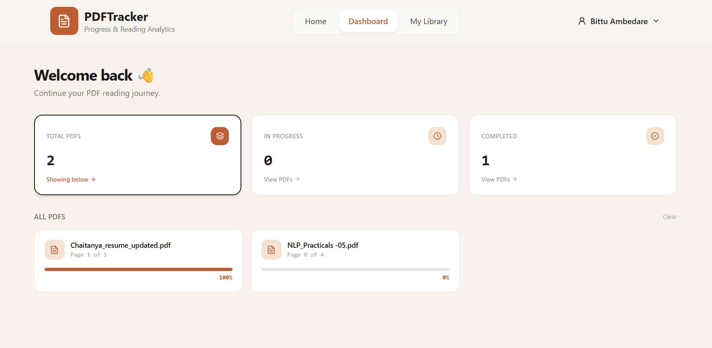
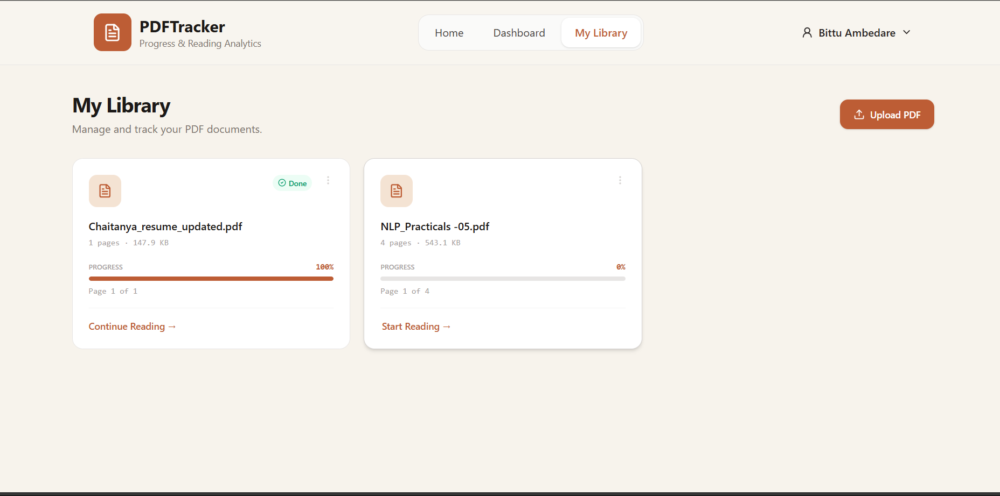
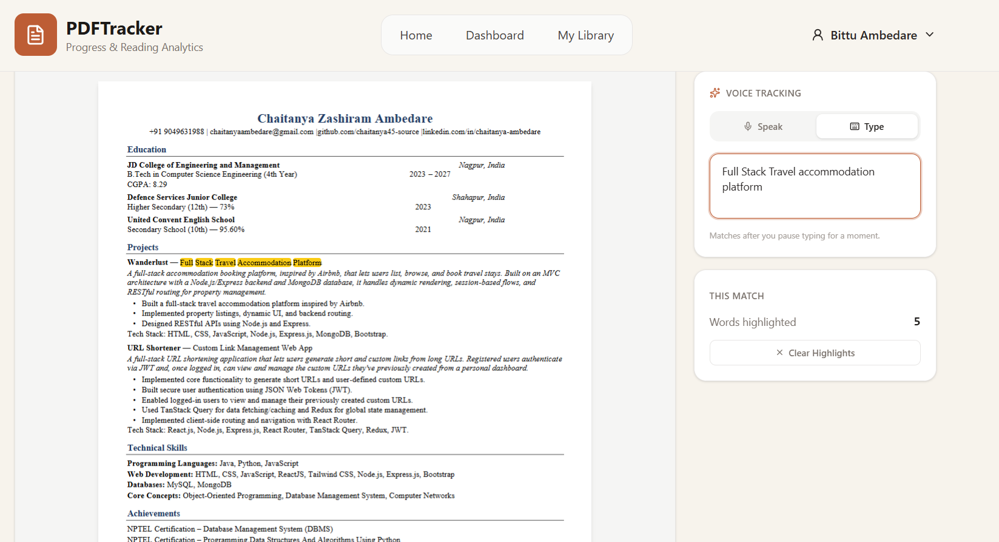

PDFTracker

Read out loud. Watch it follow along.

PDFTracker is a full-stack MERN application for managing PDF documents
and tracking reading progress. Its core feature is real-time
voice-tracked reading: users can read a PDF aloud, and PDFTracker
matches recognized words against the document's text and highlights them
live on the page.

It also supports Type mode, fuzzy matching for speech-recognition
errors, automatic reading-position persistence, and a dashboard for
tracking PDF completion.

📸 Screenshots

Dashboard

{=html}

PDF Library

{=html}

PDF Reader

{=html}

✨ Key Highlights

🎙️ Real-time voice-tracked reading

✨ Live PDF text highlighting

🧠 Fuzzy matching using Levenshtein distance

⌨️ Type mode for text-based tracking

💾 Automatic reading-progress persistence

☁️ Cloudinary PDF storage

🗄️ MongoDB Atlas database

🔐 JWT-based authentication

📊 Reading progress dashboard

📱 Responsive UI

🎙️ Core Feature: Voice-Tracked Reading

Most PDF viewers stop at displaying a document. PDFTracker goes further
by following the user while they read.

Click Start Listening, read the PDF aloud, and recognized words
are matched against the actual PDF text and highlighted live.

A Type mode is available as an alternative to speaking.

Fuzzy matching tolerates minor speech-recognition mistakes. For
example, reqirement can still match requirement using
Levenshtein distance.

Reading position is saved automatically, including the page
number, last matched word, and surrounding context.

When the PDF is opened again, the application restores the user's
previous reading position.

⚙️ How Voice Tracking Works

PDF pages can contain text, images, and other graphical content.
react-pdf, built on pdf.js, renders the page and provides a
selectable text layer containing positioned  elements.

Read the PDF text layer

Reads the actual text-layer  elements generated by
PDF.js.

Filters internal markedContent wrapper elements.

Match speech to PDF text

Splits recognized speech or typed text into words.

Searches forward through the document so continuous reading
naturally progresses in reading order.

Handle recognition errors

Uses Levenshtein distance for fuzzy matching.

Adjusts the allowed edit distance according to word length.

Highlight matched text

Groups matched words belonging to the same PDF.js text span.

Wraps matched text in styled <mark> elements so the highlight
aligns with the PDF text layer.

Persist reading position

Saves page number, last matched word, and surrounding context.

Uses saved text context to reliably relocate the reading
position when the document is reopened.

🧰 Tech Stack

Frontend

React

TanStack Router

TanStack Query

Tailwind CSS

react-pdf / pdf.js

Web Speech API (SpeechRecognition)

lucide-react

Backend

Node.js

Express

MongoDB Atlas

Mongoose

Cloudinary

pdf-parse

Multer

Backend Architecture

Routes → Controllers → Services → DAO

📦 Features

Authentication

Sign up

Sign in

Sign out

Authenticated session checks

PDF Library

Upload PDFs

View PDFs

Delete PDFs

Store PDF files on Cloudinary

Store PDF metadata in MongoDB Atlas

PDF Reader

In-browser PDF rendering

Page navigation

Live reading progress bar

Voice-Tracked Reading

Speech recognition

Live word matching

Live highlighting

Fuzzy matching with Levenshtein distance

Type Mode

Type words or lines instead of speaking

Uses the same matching and highlighting system

Reading Progress

Automatic progress saving

Page number persistence

Last matched word persistence

Surrounding context persistence

Progress restoration when reopening a PDF

Dashboard

Total PDFs

In-progress PDFs

Completed PDFs

Clickable progress categories

Responsive UI

Mobile-friendly navigation

Responsive layouts across the application

🏗️ Architecture

                         PDFTracker
                             │
              ┌──────────────┴──────────────┐
              │                             │
         React Frontend              Node + Express Backend
              │                             │
              │                    ┌────────┴────────┐
              │                    │                 │
              │                  Routes         Middleware
              │                    │
              │                Controllers
              │                    │
              │                 Services
              │                    │
              │                   DAO
              │                    │
              │            ┌───────┴────────┐
              │            │                │
              │       MongoDB Atlas      Cloudinary
              │       Metadata/Users     PDF Storage
              │
              └──────────── REST API ──────────────┘

🗂️ Project Structure

Backend

Backend/
├── src/
│   ├── config/
│   │   ├── cloudinary.js
│   │   └── mongoConfig.js
│   ├── models/
│   │   ├── user.model.js
│   │   ├── pdf.model.js
│   │   └── progress.model.js
│   ├── middleware/
│   │   ├── auth.middleware.js
│   │   └── upload.middleware.js
│   ├── dao/
│   ├── services/
│   ├── controllers/
│   └── routes/
└── package.json

Frontend

Frontend/
├── src/
│   ├── components/
│   ├── pages/
│   ├── api/
│   └── ...
└── package.json

🚀 Getting Started

Prerequisites

Node.js

MongoDB Atlas account

Cloudinary account

Git

Environment Variables

Create a .env file inside the backend:

MONGO_URI=your_mongodb_atlas_uri

CLOUD_NAME=your_cloudinary_cloud_name
CLOUD_API_KEY=your_cloudinary_api_key
CLOUD_API_SECRET=your_cloudinary_api_secret

Important: Never commit your .env file or Cloudinary API secret
to GitHub.

Installation

Backend

cd Backend
npm install
npm run dev

Frontend

cd Frontend
npm install
npm run dev

☁️ Cloudinary PDF Storage

PDF files are stored in Cloudinary, while PDF metadata and reading
progress are stored in MongoDB Atlas.

The application uses the dedicated Cloudinary folder:

pdf-progress-tracker/

MongoDB stores information such as:

PDF title

Cloudinary URL

Cloudinary public ID

File size

Total pages

User ID

Reading progress

Cloudinary note: If direct PDF delivery is restricted on your
Cloudinary account, enable Settings → Security → PDF and ZIP files
delivery so uploaded PDFs can be opened from their Cloudinary URLs.

🌐 Deployment

Recommended deployment setup:

Frontend: Vercel

Backend: Render

Database: MongoDB Atlas

File Storage: Cloudinary

After deployment, configure production environment variables, CORS, and
frontend/backend URLs.

🎯 Browser Support

Voice tracking relies on the Web Speech API (SpeechRecognition /
webkitSpeechRecognition), which has the strongest support in Chrome
and Chromium-based browsers.

If speech recognition is unavailable, PDFTracker handles it gracefully
and Type mode can still be used.

🔮 Future Improvements

Password reset flow with email-based token

Google OAuth login

Multi-language voice recognition

Reading history and analytics

Improved cross-browser speech-recognition support

👨‍💻 Project

PDFTracker --- A MERN-based PDF reading and progress-tracking
application with real-time voice-assisted highlighting.